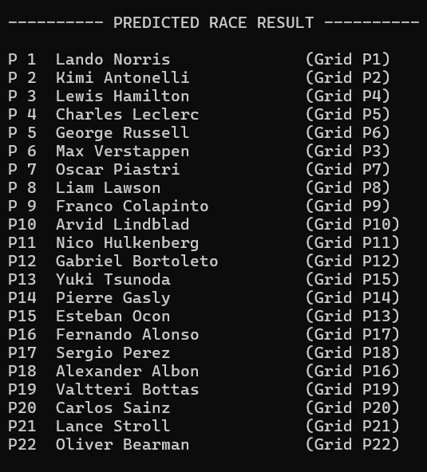

<div>


<h1>🏎️ F1 Race Outcome Predictor</h1>


<h3>Machine Learning Model For Predicting Formula 1 Race Finishing Positions</h3>


<p>

Predicting race performance using qualifying data, historical driver performance,

constructor performance, and circuit history.

</p>


<p>


</p>


<br>


</div>


<hr>


<h2>🏁 Overview</h2>


<p>

<strong>F1 Race Predictor</strong> is a machine-learning project designed to predict

Formula 1 race finishing positions using information available before a race begins.

</p>


<p>

The model combines qualifying performance, starting grid position, recent driver

performance, constructor performance, and circuit history.

</p>


<p>

Instead of predicting finishing position directly, the model predicts:

</p>


<div align="center">


<strong>Position Change = Grid Position − Finishing Position</strong>


</div>


<p>

The predicted position change is then converted into an estimated finishing position

and ranked across the field.

</p>


<hr>


<h2>⚡ Features</h2>


<table>

<tr>

<td>🏎️ Historical Formula 1 data processing</td>

<td>📊 Automated feature engineering</td>

</tr>

<tr>

<td>🧠 Random Forest regression</td>

<td>🏁 Race finishing-order prediction</td>

</tr>

<tr>

<td>📈 Driver \& constructor analysis</td>

<td>🌍 Circuit-specific history</td>

</tr>

<tr>

<td>🧪 Chronological validation</td>

<td>🔬 Blind historical race testing</td>

</tr>

</table>


<hr>


<h2>📊 Blind Test — 2026 Spanish GP</h2>


<p>

The model was deliberately trained <strong>without the 2026 Spanish Grand Prix</strong>.

</p>


<p>

Training data ended with the <strong>2026 Italian Grand Prix</strong>.

</p>


<p>

The Spanish GP was then supplied only with information available before the race:

</p>


<p>

<strong>Driver • Constructor • Circuit • Grid • Qualifying</strong>

</p>


<p>

The actual race result was kept hidden until after the prediction was generated.

</p>


<h3>🎯 Results</h3>


<table>

<tr>

<th>Metric</th>

<th>Result</th>

</tr>

<tr>

<td>Within ±1 position</td>

<td><strong>55.6%</strong></td>

</tr>

<tr>

<td>Within ±2 positions</td>

<td><strong>77.8%</strong></td>

</tr>

<tr>

<td>Mean Absolute Error</td>

<td><strong>1.83 positions</strong></td>

</tr>

<tr>

<td>RMSE</td>

<td><strong>2.37 positions</strong></td>

</tr>

</table>


<br>


<p>

<sub>

<strong>NOTE:</strong> The four race retirements in the actual 2026 Spanish GP were excluded from this particular evaluation.

</sub>

</p>

<h3>🏎️ Predicted Race Output</h3>

<p>
The model-generated finishing order for the blind-test race is shown below.
</p>




<hr>


<h2>🧠 Model</h2>


<h3>🌲 Random Forest Regressor</h3>


<p>

The production model is a Random Forest regression model trained on

<strong>2,124 driver-race records</strong> using <strong>13 engineered features</strong>.

</p>


<table>

<tr>

<th>⚙️ Configuration</th>

<th>Value</th>

</tr>

<tr>

<td>🌲 Number of Trees</td>

<td><strong>400</strong></td>

</tr>

<tr>

<td>📏 Maximum Depth</td>

<td><strong>8</strong></td>

</tr>

<tr>

<td>🔀 Maximum Features</td>

<td><strong>sqrt</strong></td>

</tr>

<tr>

<td>📦 Minimum Samples per Leaf</td>

<td><strong>1</strong></td>

</tr>

<tr>

<td>📦 Minimum Samples per Split</td>

<td><strong>2</strong></td>

</tr>

<tr>

<td>🎲 Random State</td>

<td><strong>42</strong></td>

</tr>

</table>


<br>


<table>

<tr>

<td><strong>Why Random Forest?</strong></td>

</tr>

<tr>

<td>

Random Forest was selected after chronological validation against alternative

regression approaches during development.

</td>

</tr>

</table>


<hr>


<h2>🔬 Features</h2>


<p>

The model uses <strong>13 engineered features</strong> covering qualifying performance,

recent performance, constructor performance, and circuit history.

</p>


<h3>🏁 Qualifying \& Grid</h3>


<ul>

<li>Grid position</li>

<li>Qualifying position</li>

<li>Qualifying-to-grid gap</li>

</ul>


<h3>📈 Recent Performance</h3>


<ul>

<li>Recent average finishing position</li>

<li>Recent finishing-position standard deviation</li>

<li>Recent average qualifying position</li>

<li>Recent average qualifying-to-finish change</li>

<li>Recent average constructor finishing position</li>

<li>Recent average constructor qualifying position</li>

</ul>


<h3>🌍 Circuit \& Position History</h3>


<ul>

<li>Driver circuit history</li>

<li>Circuit average position change</li>

<li>Driver circuit average position change</li>

<li>Recent average position change</li>

</ul>


<p>

<sub>

Historical features are calculated using previous races so that information from

the current race is not used as an input.

</sub>

</p>


<hr>


<h2>📚 Dataset</h2>


<p>

Historical Formula 1 data currently covers:

</p>


<h3>2022 → 2026 Italian Grand Prix</h3>


<table>

<tr>

<td>🏁 Driver-race records</td>

<td><strong>2,124</strong></td>

</tr>

<tr>

<td>🏎️ Races</td>

<td><strong>105</strong></td>

</tr>

<tr>

<td>🧠 Model features</td>

<td><strong>13</strong></td>

</tr>

</table>


<p>

The Spanish Grand Prix was intentionally excluded from training for the blind-test experiment.

</p>


<hr>


<h2>🔄 Prediction Pipeline</h2>


<p>

The prediction system transforms historical race data into a predicted finishing order

through a sequence of data-processing and machine-learning stages.

</p>


<table>

<tr>

<th>Stage</th>

<th>Process</th>

<th>Output</th>

</tr>


<tr>

<td><strong>01</strong></td>

<td>🏁 Historical F1 Data</td>

<td>Clean race records</td>

</tr>


<tr>

<td><strong>02</strong></td>

<td>🧹 Data Cleaning</td>

<td>Structured driver-race data</td>

</tr>


<tr>

<td><strong>03</strong></td>

<td>⚙️ Feature Engineering</td>

<td>13 model features</td>

</tr>


<tr>

<td><strong>04</strong></td>

<td>📊 Historical Driver / Constructor / Circuit Analysis</td>

<td>Pre-race performance signals</td>

</tr>


<tr>

<td><strong>05</strong></td>

<td>🌲 Random Forest</td>

<td>Predicted position change</td>

</tr>


<tr>

<td><strong>06</strong></td>

<td>🏎️ Qualifying + Grid Information</td>

<td>Race-specific input</td>

</tr>


<tr>

<td><strong>07</strong></td>

<td>📈 Position Change → Estimated Finish</td>

<td>Estimated finishing position</td>

</tr>


<tr>

<td><strong>08</strong></td>

<td>🏆 Race Ranking</td>

<td>Predicted race order</td>

</tr>


</table>


<p>

<strong>Historical Data → Features → Random Forest → Position Change → Finishing Position → Race Order</strong>

</p>


<hr>


<h2>🛠️ Tech Stack</h2>


<table>

<tr>

<th>Technology</th>

<th>Purpose</th>

</tr>

<tr>

<td>🐍 <strong>Python</strong></td>

<td>Core development</td>

</tr>

<tr>

<td>🐼 <strong>pandas</strong></td>

<td>Data processing</td>

</tr>

<tr>

<td>🔢 <strong>NumPy</strong></td>

<td>Numerical operations</td>

</tr>

<tr>

<td>🤖 <strong>scikit-learn</strong></td>

<td>Machine learning</td>

</tr>

<tr>

<td>🌲 <strong>Random Forest</strong></td>

<td>Prediction model</td>

</tr>

<tr>

<td>🔧 <strong>Git</strong></td>

<td>Version control</td>

</tr>

<tr>

<td>☁️ <strong>GitHub</strong></td>

<td>Project hosting</td>

</tr>

</table>


<hr>


<h2>📁 Project Structure</h2>


```text

F1-Race-Predictor/

│

├── build\_training\_dataset.py

├── train\_model.py

├── train\_final\_model.py

├── predict\_race.py

├── update\_raw\_data.py

│

├── f1\_2022\_2026\_raw.csv

├── f1\_training\_dataset.csv

├── race\_input.csv

├── requirements.txt

│

├── archive/

│   └── Development scripts

│

├── .gitignore

└── README.md

```


<hr>


<h2>🚀 Run Locally</h2>


<h3>1. Clone the repository</h3>


```bash

git clone https://github.com/MuzzammilSidd/F1-Race-Predictor.git

cd F1-Race-Predictor

```


<h3>2. Create a virtual environment</h3>


```bash

python -m venv .venv

```


<h3>3. Activate the environment</h3>


<p><strong>Windows:</strong></p>


```bash

.venv\\Scripts\\activate

```


<h3>4. Install dependencies</h3>


```bash

pip install -r requirements.txt

```


<h3>5. Build the training dataset</h3>


```bash

python build\_training\_dataset.py

```


<h3>6. Train the model</h3>


```bash

python train\_final\_model.py

```


<h3>7. Enter race information</h3>


<p>

Update <code>race\_input.csv</code> with:

</p>


<ul>

<li>Driver</li>

<li>Constructor</li>

<li>Circuit</li>

<li>Grid position</li>

<li>Qualifying position</li>

</ul>


<h3>8. Generate a prediction</h3>


```bash

python predict\_race.py

```


<p>

The predicted race order is saved to:

</p>


```text

race\_prediction.csv

```


<hr>


<h2>⚠️ Limitations</h2>


<p>

Formula 1 contains unpredictable events that cannot always be inferred from

pre-race information.

</p>


<ul>

<li>Mechanical failures</li>

<li>Accidents</li>

<li>Penalties</li>

<li>Safety cars</li>

<li>Weather changes</li>

<li>Strategy decisions</li>

<li>Race incidents</li>

</ul>


<p>

The model should therefore be viewed as a <strong>statistical prediction system</strong>,

not a guaranteed race-result generator.

</p>


<hr>


<h2>🔮 Future Development</h2>


<ul>

<li>🌦️ Weather information</li>

<li>🛞 Tyre compounds and strategy</li>

<li>⏱️ Practice and sector times</li>

<li>🔧 Pit-stop performance</li>

<li>🚨 Dedicated DNF prediction</li>

<li>🤖 Additional machine-learning models</li>

<li>📊 Larger chronological validation</li>

<li>🌐 Interactive web interface</li>

<li>📡 Live race prediction dashboard</li>

</ul>


<hr>


<h2>👤 Author</h2>


<p>

<strong>Muzzammil Siddiqi</strong>

</p>


<p>

<a href="https://github.com/MuzzammilSidd">GitHub Profile</a>

</p>


